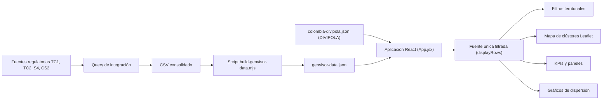

# Documento de Arquitectura
# Geovisor Energía Caribe

> Versión actualizada — mayo 2026. Refleja la migración del lenguaje a
> "suscriptores/hogares", el mapa por clústeres, las capas analíticas vigentes,
> los gráficos de dispersión ampliados, el catálogo nacional DIVIPOLA para
> filtros y la fuente única de datos filtrados.

## 1. Propósito

El Geovisor Energía Caribe es una aplicación web orientada al análisis territorial de los suscriptores/hogares del servicio de energía eléctrica en la región Caribe colombiana. Su objetivo es facilitar la lectura geográfica de consumo, mora, continuidad del servicio (DIU/FIU), zonas especiales FOES, estrato y pérdidas de energía, integrando información de suscriptores, facturación, áreas especiales e indicadores de calidad del servicio.

El visor permite pasar de una base tabular de más de tres millones de registros a una experiencia visual consultable mediante mapa de concentración, filtros territoriales, indicadores, leyendas, gráficos de dispersión y paneles de composición territorial.

## 2. Necesidad que Atiende

La información operativa del servicio de energía suele estar distribuida en tablas técnicas y reportes regulatorios. Esta estructura dificulta identificar patrones territoriales, concentraciones de suscriptores/hogares, zonas con mora, áreas especiales, pérdidas de energía o condiciones de calidad del servicio.

El geovisor responde a las siguientes necesidades:

- Analizar suscriptores/hogares georreferenciados por empresa comercializadora, mercado, departamento, municipio, estrato y zona especial FOES.
- Detectar concentraciones territoriales con alto consumo, alta mora, alta DIU, alta FIU, estrato vulnerable o zona especial FOES.
- Consultar indicadores generales sin procesar manualmente archivos grandes.
- Validar calidad de datos geográficos y operativos antes de la explotación analítica.
- Presentar información territorial de forma comprensible para equipos técnicos, directivos y territoriales.

## 3. Alcance Funcional

La versión implementada incluye:

- Carga de dataset local optimizado desde `public/data/geovisor-data.json`.
- Fallback de carga desde CSV con `Papa Parse`.
- Carga del catálogo nacional DIVIPOLA desde `public/data/colombia-divipola.json` para poblar dinámicamente Departamento y Municipio.
- Mapa interactivo con Leaflet y React Leaflet, renderizado **por clústeres** que muestran la concentración de suscriptores/hogares por zona.
- Popups/tooltips de clúster con cantidad, estrato, departamento, municipio, coordenadas promedio, consumo, mora, DIU, FIU, zona especial FOES y pérdida de energía.
- Filtros territoriales y comerciales (Empresa, Mercado, Departamento, Municipio, Sector/barrio, Zona especial FOES, Tipo de servicio, Estrato, Condición especial).
- Dependencia Departamento → Municipio (el municipio se valida y reinicia al cambiar el departamento).
- Modos de visualización: "Lectura del mapa" (coloreado) y "Capa analítica" (resaltado), que **no** modifican el universo filtrado.
- KPIs principales calculados solo con los registros filtrados (indicadores de continuidad del servicio).
- Gráficos de dispersión: Consumo vs Mora, Consumo vs Pérdida, DIU vs FIU, Consumo vs Interrupción, Consumo vs Estrato y Consumo vs Zonas especiales FOES.
- Paneles de composición territorial, mora/comportamiento comercial, análisis por estrato y zona especial, y pérdida de energía por territorio.
- Tabla paginada de muestra de suscriptores/hogares filtrados.
- Leyendas visuales de color, tamaño de clúster, mora y capas analíticas.
- Validaciones de calidad de datos.

## 4. Fuentes de Información

La fuente base es un dataset construido a partir de información regulatoria del sector eléctrico. El archivo de entrada usado en el proyecto es:

`public/data/dnp_tc1_tc2_s4_cs2_2026-02.csv`

El archivo original fue recibido comprimido como:

`dnp_tc1_tc2_s4_cs2_2026-02.7z`

El CSV contiene registros integrados de las siguientes fuentes lógicas:

- `CAR_T1732_TC1_INV_USUARIOS`: inventario de suscriptores y datos geográficos.
- `CAR_T1743_TC2FACTURACION_USU`: información de consumo y días de mora.
- `CAR_T1682_INV_AREA_ESP_FOES`: información de áreas especiales FOES y porcentaje de pérdida de energía.
- `CAR_T1729_CS2_DIU_FIU`: duración (DIU) y frecuencia (FIU) de interrupciones del servicio.

Catálogo complementario para filtros geográficos:

- `public/data/colombia-divipola.json`: listado oficial DIVIPOLA de los 32 departamentos + Bogotá y sus municipios, usado para poblar los selectores de Departamento y Municipio con cobertura nacional completa.

## 5. Variables Usadas

Variables geográficas:

- `TC1_LATITUD_USU`
- `TC1_LONGITUD_USU`

Variables de identificación:

- `TC1_ID_COMER`
- `TC1_ID_MERCADO`
- `TC1_NIU`

Variables comerciales y sociales:

- `ESTRATO`
- `CONDICIONES_ESP`
- `TIPO_AREA_ESP`
- `TC1_COD_AREA_ESP`

Variables analíticas:

- `CAR_T1743_CONS_USUARIO` (consumo kWh/mes)
- `CAR_T1743_DIAS_MORA` (días de mora)
- `S4_PORC_PERDIDA_ENE` (% pérdida de energía)
- `DIU` (duración de interrupción — horas/suscriptor/año)
- `FIU` (frecuencia de interrupción — interrupciones/suscriptor/año)

> Nota terminológica: los nombres de columnas del CSV/SQL conservan el término
> técnico "usuario" (`CONS_USUARIO`, `INV_USUARIOS`, etc.). En la interfaz, todo
> el lenguaje visible se presenta como "suscriptores/hogares".

## 6. Query Base de Integración

El dataset se construye integrando TC1, TC2, S4 y CS2. El query base usado como referencia funcional es:

```sql
select distinct
    tc1.TC1_ID_COMER,
    tc1.TC1_ID_MERCADO,
    tc1.TC1_NIU,
    tc1.TC1_LATITUD_USU,
    tc1.TC1_LONGITUD_USU,
    tc1.CONDICIONES_ESP,
    tc1.TIPO_AREA_ESP,
    tc1.TC1_COD_AREA_ESP,
    tc1.ESTRATO,
    tc2.CAR_T1743_CONS_USUARIO,
    tc2.CAR_T1743_DIAS_MORA,
    s4_t.S4_PORC_PERDIDA_ENE,
    cs2_t.DIU,
    cs2_t.FIU
from (
    select distinct
        CAR_T1732_NIU as TC1_NIU,
        CAR_T1732_ID_COMER as TC1_ID_COMER,
        CAR_T1732_ID_MERCADO as TC1_ID_MERCADO,
        decode(
            CAR_T1732_CONDICIONES_ESP,
            0, 'Ninguna',
            1, 'Especial Asistencial',
            2, 'Especial Educativo',
            3, 'Areas Comunes',
            4, 'Bombeo',
            5, 'Distrito de Riego',
            6, 'Hogar Comunitario',
            7, 'Inquilinato',
            8, 'Patrimonio Historico',
            9, 'Asentamiento Indigena',
            10, 'Vivienda de Interes Social o Prioritario',
            11, 'Patrimonio Historico',
            12, 'Pequeños Productores Rurales'
        ) as CONDICIONES_ESP,
        CAR_T1732_TIPO_AREA_ESP as TC1_TIPO_AREA_ESP,
        decode(
            CAR_T1732_TIPO_AREA_ESP,
            1, 'Barrio Subnormal',
            2, 'Area Rural de Menor Desarrollo',
            3, 'Zonas de Dificil Gestion'
        ) as TIPO_AREA_ESP,
        CAR_T1732_COD_AREA_ESP as TC1_COD_AREA_ESP,
        decode(
            CAR_T1732_ESTRATO_SECTOR,
            1, '1-Bajo-Bajo',
            2, '2-Bajo',
            3, '3-Medio-Bajo',
            4, '4-Medio',
            5, '5-Medio-Alto',
            6, '6-Alto',
            7, 'Industrial',
            8, 'Comercial',
            9, 'Oficial',
            10, 'Provisional',
            11, 'Alumbrado Publico'
        ) as ESTRATO,
        CAR_T1732_LONGITUD_USU as TC1_LONGITUD_USU,
        CAR_T1732_LATITUD_USU as TC1_LATITUD_USU
    from ENERGIA_CREG_015.CAR_T1732_TC1_INV_USUARIOS
    where car_carg_ano = :v_anio
      and car_carg_periodo = :v_mes
      and substr(car_t1732_dane_niu, 1, 2) in ('08', '88', '13', '20', '23', '44', '47', '70')
      and substr(CAR_T1732_NIU, 1, 4) != 'CALP'
) tc1
inner join (
    select *
    from ENERGIA_CREG_015.CAR_T1743_TC2FACTURACION_USU
    where car_carg_ano = :v_anio
      and car_carg_periodo = :v_mes
      and substr(CAR_T1743_MERCADO_NIU, 1, 4) != 'CALP'
) tc2
    on tc1.TC1_ID_COMER = tc2.identificador_empresa
   and tc1.TC1_ID_MERCADO = tc2.CAR_T1743_ID_MERCADO
   and tc1.TC1_NIU = tc2.CAR_T1743_MERCADO_NIU
left join (
    select
        s4.CAR_T1682_TIPO_AREA as S4_TIPO_AREA,
        s4.CAR_T1682_COD_AREA as S4_COD_AREA,
        s4.CAR_T1682_PORC_PERDIDA_ENE as S4_PORC_PERDIDA_ENE,
        s4.CAR_T1682_ID_MERCADO as S4_ID_MERCADO,
        s4.IDENTIFICADOR_EMPRESA as id_empresa,
        s4.car_carg_ano,
        s4.car_carg_mes
    from ENERGIA_CREG_015.CAR_T1682_INV_AREA_ESP_FOES s4
    inner join CARG_ARCH.car_carg_cargues c
        on s4.car_carg_secue = c.car_carg_secue
    where s4.car_carg_ano = :v_anio
      and s4.car_carg_mes = :v_mes
) s4_t
    on tc1.TC1_ID_COMER = s4_t.id_empresa
   and tc1.TC1_TIPO_AREA_ESP = s4_t.S4_TIPO_AREA
   and tc1.TC1_COD_AREA_ESP = s4_t.S4_COD_AREA
left join (
    select
        cs2.CAR_T1729_NIU as NIU,
        cs2.CAR_T1729_DIU as DIU,
        cs2.CAR_T1729_FIU as FIU,
        cs2.CAR_T1729_ID_MERCADO as ID_MERCADO,
        cs2.IDENTIFICADOR_EMPRESA as id_empresa,
        cs2.car_carg_ano,
        cs2.car_carg_mes
    from ENERGIA_CREG_015.CAR_T1729_CS2_DIU_FIU cs2
    inner join CARG_ARCH.car_carg_cargues c
        on cs2.car_carg_secue = c.car_carg_secue
    where cs2.car_carg_ano = :v_anio
      and cs2.car_carg_mes = :v_mes
) cs2_t
    on tc1.TC1_ID_COMER = cs2_t.id_empresa
   and tc1.TC1_NIU = cs2_t.NIU
   and tc1.TC1_ID_MERCADO = cs2_t.ID_MERCADO
order by 1, 2, 3;
```

## 7. Volumen Procesado

Para la versión construida (`geovisor-data.json` generado el 2026-05-25) se procesaron:

- Registros totales del CSV: `3.255.638`
- Suscriptores/hogares con coordenadas válidas: `3.254.242`
- Registros sin coordenadas: `1.396`
- Coordenadas fuera de Colombia: `0`
- Suscriptores/hogares en zona especial FOES: `1.335.075`
- Suscriptores/hogares en mora: `435.019` (≈ `13,85 %`)
- Consumo promedio: `≈ 398,9 kWh/mes`
- Pérdida promedio territorial: `≈ 30,96 %`
- Puntos de muestra para visualización (`SAMPLE_LIMIT`): `110.000`
- Clústeres territoriales precalculados en el JSON: `1.600`
- Combinaciones empresa·municipio·departamento (`filterCounts`): `48` (más `36` residenciales)
- Sectores críticos calculados: `50`

La reducción a una muestra visual no elimina el universo analítico: las métricas globales (sin filtros) se calculan sobre la base completa procesada. Cuando hay filtros activos, los indicadores se recalculan sobre los registros filtrados de la muestra.

## 8. Arquitectura General



## 9. Componentes de Software

Estructura principal del proyecto:

```text
geovisor_energia_caribe/
  package.json
  vite.config.js
  index.html
  scripts/
    build-geovisor-data.mjs
  public/
    data/
      dnp_tc1_tc2_s4_cs2_2026-02.csv
      geovisor-data.json
      colombia-divipola.json
    superservicios-logo.png
  src/
    main.jsx
    App.jsx
    index.css
    App.css
    components/
      FiltersPanel.jsx
      ActiveFiltersBar.jsx
      KpiCards.jsx
      MapView.jsx
      MapZonePopup.jsx
      ClusterPopup.jsx
      ScatterChart.jsx
      Legend.jsx
    utils/
      dataCleaning.js
      colorScales.js
      labels.js
      mapClusters.js
  docs/
    arquitectura_geovisor_energia_caribe.md
```

Responsabilidades:

- `scripts/build-geovisor-data.mjs`: prepara el JSON optimizado desde el CSV original (muestreo, métricas, distribuciones, clústeres, `filterCounts`).
- `src/App.jsx`: orquesta la carga de datos (JSON optimizado + DIVIPOLA), construye la **fuente única filtrada** (`displayRows`), gestiona estado de filtros y dependencia Departamento→Municipio, y compone el layout.
- `src/components/FiltersPanel.jsx`: filtros territoriales/comerciales y modos de visualización; el Municipio depende del Departamento seleccionado.
- `src/components/ActiveFiltersBar.jsx`: muestra los filtros activos y la relación muestra vs base completa.
- `src/components/KpiCards.jsx`: indicadores de continuidad del servicio (con aclaración de que son registros filtrados, no población DANE).
- `src/components/MapView.jsx`: renderiza el mapa y los **clústeres** generados en cliente desde los datos filtrados.
- `src/components/ClusterPopup.jsx`: popup-resumen de cada clúster (concentración + métricas territoriales).
- `src/components/MapZonePopup.jsx`: popup de detalle por registro individual.
- `src/components/ScatterChart.jsx`: gráficos de dispersión con presets numéricos y categóricos (estrato, zona FOES).
- `src/components/Legend.jsx`: convenciones visuales y capas analíticas.
- `src/utils/dataCleaning.js`: normaliza datos, valida coordenadas, construye opciones de filtro (incluida la fusión con DIVIPOLA), aplica filtros, calcula umbrales/capas y métricas.
- `src/utils/colorScales.js`: paleta institucional y funciones de color/tamaño/opacidad.
- `src/utils/labels.js`: etiquetas estándar DIU/FIU, catálogo de capas analíticas y normalización de capas descontinuadas.
- `src/utils/mapClusters.js`: agrupación geográfica por grilla (`buildMapClusters`) para el mapa.

## 10. Pipeline de Transformación

El proceso de preparación se ejecuta con:

```bash
node scripts/build-geovisor-data.mjs
```

Constantes principales del script:

- `SAMPLE_LIMIT = 110000` (tamaño de muestra visual).
- `GRID_SIZE = 0.025` (grilla de clústeres precalculados).
- `SPATIAL_GRID = 0.008` (grilla de muestreo espacial).
- `TOP_LIMIT = 10` (tamaño de distribuciones top).
- Límites de muestra por departamento y municipio para garantizar cobertura territorial equilibrada.

Pasos principales:

1. Lee el CSV consolidado con separador `|`.
2. Normaliza números, coordenadas y textos.
3. Valida coordenadas dentro de Colombia con rango aproximado:
   - Latitud: `-4.5` a `13.8`
   - Longitud: `-82` a `-66`
4. Traduce comercializadores y mercados principales (Air-e / Afinia / Enerbit; Caribe Sol / Caribe Mar).
5. Infiere departamento y municipio por rangos/bboxes geográficos aproximados.
6. Calcula métricas globales sobre el universo completo.
7. Genera la muestra visual priorizando registros informativos y cobertura por departamento/municipio.
8. Genera clústeres territoriales por grilla geográfica y sectores críticos.
9. Construye `filterCounts` y `residentialFilterCounts` (empresa·municipio·departamento) para los conteos de base completa.
10. Escribe `public/data/geovisor-data.json`.

## 11. Modelo de Datos Optimizado

El archivo `geovisor-data.json` contiene:

```json
{
  "generatedAt": "fecha de generación",
  "source": "archivo CSV fuente",
  "metrics": {},
  "distributions": {},
  "clusters": [],
  "controlSectors": [],
  "filterCounts": [],
  "residentialFilterCounts": [],
  "sample": []
}
```

Contenido:

- `metrics`: totales, promedios y validaciones globales (incluye `porcentajeUsuariosEnMora`, `promedioDiu`, `promedioFiu`, `promedioPerdida`).
- `distributions`: distribución por estrato, tipo de área especial, condición especial, comercializador, mercado, departamento, municipio, zona y sector.
- `clusters`: concentraciones territoriales agregadas (precalculadas).
- `controlSectors`: sectores priorizados para vigilancia.
- `filterCounts` / `residentialFilterCounts`: conteos por empresa·municipio·departamento para mostrar la base completa por selección.
- `sample`: puntos representativos para render rápido en mapa, clústeres en cliente, gráficos y tabla.

## 12. Modelo de Filtrado y Fuente Única

Toda la información mostrada parte de una **única fuente filtrada**:

```text
rows (muestra)
  -> applyFilters(filtros de datos)            => filteredRows
  -> filterByAnalyticLayer(capa analítica)     => analyticRows = displayRows
```

- **Filtros de datos** (sí reducen el universo): Empresa, Mercado, Departamento, Municipio, Sector/barrio, Zona especial FOES, Tipo de servicio, Estrato, Condición especial.
- **Modos de visualización** (no cambian el universo):
  - "Lectura del mapa" (`visualMode`): solo colorea (zona, consumo, mora, pérdida).
  - "Capa analítica" (`capaAnalitica`): resalta/acota dentro del conjunto ya filtrado; nunca amplía ni trae otros municipios.
- `displayRows` alimenta KPIs, mapa, clústeres, tooltips/popups, leyendas, gráficos de dispersión, tabla y paneles.
- Dependencia Departamento→Municipio: al cambiar el departamento, si el municipio no pertenece, se reinicia a "Todos". "Limpiar" restablece todos los filtros y recalcula con la base completa.

> Aclaración de indicadores: el total de "Suscriptores/hogares registrados en la
> base" corresponde a **registros del dataset filtrado** (muestra del visor), no a
> población oficial DANE. El detalle "Base completa" usa `filterCounts`.

## 13. Reglas de Visualización

Paleta institucional:

- `#2363c3`, `#0081bd`, `#00ae80`, `#fcc700`, `#fbaf1e`, `#fb8521`

Reglas visuales:

- Mapa por **clústeres**: tamaño del clúster por concentración de suscriptores/hogares.
- Color del clúster/punto según "Lectura del mapa" (zona especial, consumo, mora o pérdida).
- Opacidad asociada a días de mora.
- Capas analíticas disponibles en el selector:
  - Concentración de suscriptores/hogares (sin acotar).
  - Alto consumo.
  - Alta mora.
  - Alta DIU.
  - Alta FIU.
  - Estrato 1-2.
  - Zona especial FOES.

> La capa "Alta pérdida" / "Pérdida de energía (%)" fue retirada del selector. Si
> quedara persistida en estado, se normaliza automáticamente a "Concentración de
> suscriptores/hogares".

## 14. Filtros Implementados

Filtros categóricos (datos):

- Empresa comercializadora.
- Mercado.
- Departamento (catálogo nacional DIVIPOLA + dataset).
- Municipio (dependiente del Departamento; catálogo DIVIPOLA + dataset).
- Sector / barrio operativo.
- Tipo de zona especial (FOES).
- Tipo de servicio (Residencial / No residencial).
- Estrato.
- Condición especial del servicio.

Modos de visualización:

- Lectura del mapa.
- Capa analítica.

> Los rangos numéricos (consumo, mora, DIU, FIU, pérdida) permanecen disponibles en
> la lógica de `applyFilters`, pero la interfaz prioriza filtros categóricos.

## 15. Gráficos de Dispersión

Presets disponibles (cada punto = un suscriptor/hogar):

- Consumo vs Mora.
- Consumo vs Pérdida.
- DIU vs FIU.
- Consumo vs Interrupción (DIU + FIU).
- Consumo vs Estrato (eje X categórico; color diferencia zona especial FOES).
- Consumo vs Zonas especiales FOES (eje X categórico por tipo de zona).

## 16. Validaciones de Calidad de Datos

El visor reporta:

- Registros sin latitud o longitud.
- Coordenadas fuera de Colombia.
- Consumos nulos o negativos.
- DIU/FIU nulos.
- Estratos no válidos.

Estas validaciones permiten evaluar si el dataset es apto para análisis territorial antes de tomar decisiones operativas.

## 17. Stack y Decisiones Técnicas

Stack:

- React `19.x` + Vite `8.x`.
- Leaflet `1.9` + React Leaflet `5.x`.
- Papa Parse `5.x` (fallback de carga CSV).
- ESLint `10.x`.

Decisiones:

- React + Leaflet por bajo costo de implementación, mapas interactivos con clústeres, integración sencilla con filtros/paneles, independencia de tokens externos (Mapbox) y buena compatibilidad con despliegues estáticos.
- Se generó `geovisor-data.json` porque el CSV original pesa cientos de MB con más de tres millones de registros; procesarlo en el navegador degrada la experiencia. El JSON optimizado reduce el tiempo de carga y mantiene indicadores agregados del universo completo.
- Se incorporó `colombia-divipola.json` para que los selectores de Departamento y Municipio ofrezcan cobertura nacional completa, fusionando el catálogo oficial con los valores reales del dataset.
- Los clústeres del mapa se construyen en cliente (`buildMapClusters`) sobre los datos ya filtrados para que la concentración mostrada respete siempre la selección activa.

## 18. Ejecución Local

Instalar dependencias:

```bash
npm install
```

Regenerar datos optimizados:

```bash
node scripts/build-geovisor-data.mjs
```

Compilar:

```bash
npm run build
```

Vista local de producción:

```bash
npm run preview -- --host 127.0.0.1 --port 4174 --strictPort
```

URL local:

```text
http://127.0.0.1:4174/
```

## 19. Consideraciones y Próximos Pasos

Recomendaciones para una versión productiva:

- Reemplazar inferencia de departamento/municipio por cruce oficial DANE o polígonos administrativos.
- Obtener catálogo oficial de `IDENTIFICADOR_EMPRESA` para todos los comercializadores.
- Incorporar polígonos departamentales y municipales.
- Publicar datos optimizados desde un endpoint API.
- Agregar control de periodo: año y mes.
- Incorporar conteos de base completa por todos los filtros (no solo territoriales).
- Incorporar exportación de filtros y datos agregados.
- Implementar autenticación si el visor se publica fuera de un entorno controlado.
- Separar visualización pública de datos sensibles o identificadores individuales.

## 20. Resumen Ejecutivo

El Geovisor Energía Caribe convierte información regulatoria tabular de suscriptores/hogares de energía en una herramienta territorial interactiva. La arquitectura separa la integración y preparación de datos del renderizado web, permitiendo que el navegador consulte un archivo optimizado en lugar del CSV completo. Una fuente única de datos filtrados alimenta de forma consistente KPIs, mapa de clústeres, gráficos de dispersión, tablas y paneles. La solución habilita análisis por empresa, mercado, departamento, municipio, estrato, condición especial, zona especial FOES, consumo, mora, continuidad del servicio (DIU/FIU) y pérdidas de energía, con validaciones de calidad y visualización geográfica orientada a la toma de decisiones.
